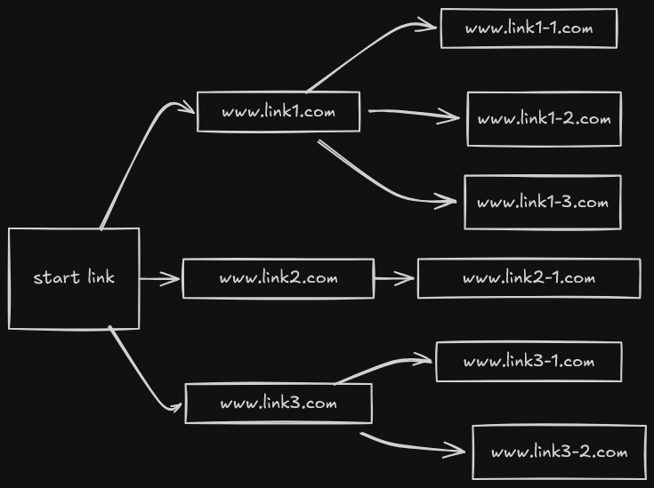
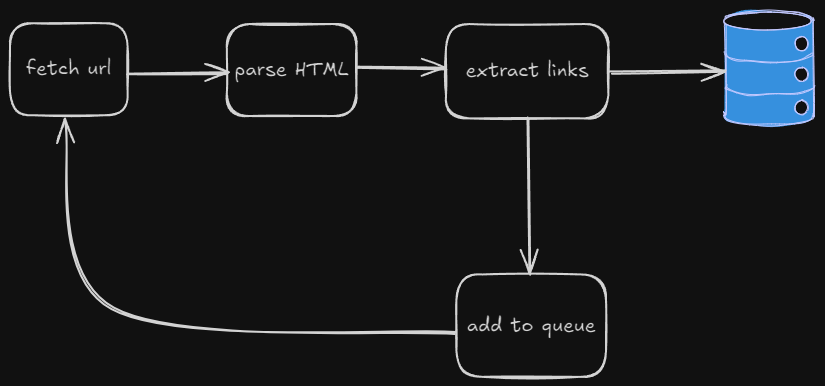
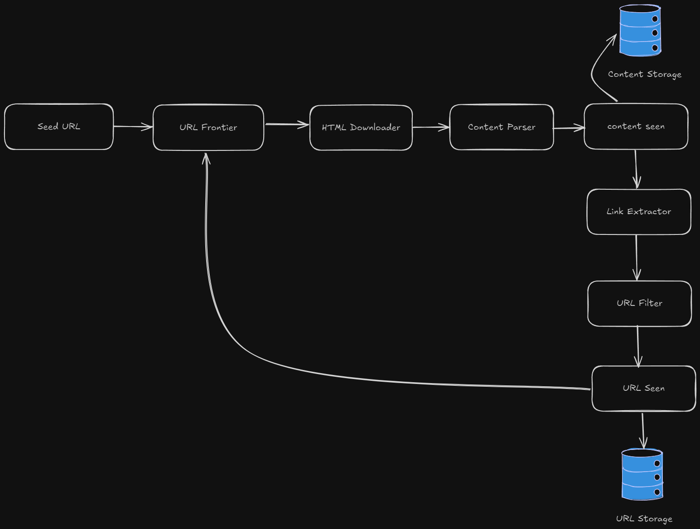

# Designing a web crawler

## Introduction:

### What is a Web Crawler?
A web crawler is a computer application which is like a robot, it is widely used to discover new
or updated content on the web, these content can include text, image, video, pdf or anything.

A web crawler starts by collecting some web pages first and then follows the links
on those pages to collect new content

### What are the applications of a web crawler?
1. this is the  most common use case is search engine indexing, a crawler collects web pages
    to create local index for search engines.
2. web mining can be done to extract useful knowledge from the web.

>Note: First, I am planning to build a simple model of a web crawler without worrying about scalability.

## A simplistic model working model in java(single threaded):

the simple version goes something like this:

1. fetch url: module to make fetch HTML contents of web pages.
2. parse HTML: parse the HTML content to extract data.
3. extract links: extract links in the web page and add them if they are not already
    explored.
4. store the web page content in a database, for our case we go for mongoDB
5. add to queue: add the extracted links(if not explored already) to the queue.

for this version, I am using HashMaps to store data instead of a database.

## Working on the complete version

### Requirements

#### Functional requirements
- should crawl around 1B pages every month.
- only need to store HTML content.
- data should be saved up to 5 years.

#### Non-Functional requirements
- the system should be scalable
- the crawler should not make too many requests to a single server with in
    a short amount of time because it can be considered a dos(denial of service)
    attack and is impolite to do so.
- the system should be flexible and open to changes.

### Estimation
- Qps: 1B / (30 * 86400) = 400 queries per second.
- peak Qps: 800
- assuming the average size of each web page is 500KB, 1B * 500KB = 500TB
    is the storage requirement per month
- 500TB * 12 * 5 = 30PB is the total storage requirement of the system.

### High level design

Below is the high-level-design of a web-crawler(similar to the book, i am reading):

If you think about it, this crawling process is really similar to graph traversal
where web-pages are nodes and links are edges, we traverse a portion of this
huge graph(web), going from node to nodes(web-pages) to collect the information
that we need which could HTML, images, links, etc.

1. **Seed URL**:
    this is the first url from which the crawling process will start, in graph
    terms it could be seen as the root node, or the node from which the search
    process starts.

    how to choose it depends on the part of the web you want to crawl, like crawling 
    a college website or based on some geo-graphical location.
2. **URL Frontier**:
    URL frontier is a FIFO(first in first out) queue which keeps track of the urls
    that we have not visited yet.
3. **HTML Downloader**:
    It downloads the html web-pages from the internet as provided by the url frontier.
4. **Content Parser**:
    Content parses sanitises the web-pages which helps in avoiding potential future problems.
5. **Content Seen**:
    the content seen data structure helps avoid crawling duplicate web-sites,
    we simply compare the hash of sites content with the database to check if it's duplicate,
    if yes then ignore it.
6. **Content storage**:
    A disk-based storage(database) to store the content of the web-pages,
    in our use case we want to store HTML data in database.
7. **URL Extractor**:
    extracts urls from the web-page.
8. **URL Filter**:
    filter url based on some pre-defined criteria, suppose we want to avoid url
    from wikipedia, in that case we can simply avoid any url starting by their domain name.
9. **URL Seen**:
    Url seen keeps track of the already visited urls or the urls already present in the url frontier,
    to check whether we have seen a certain url or not we can use bloom filter.
10. **URL Storage**:
    here we are keeping the already visited urls.

#### Which database to use for Content Storage?

we are preferring No-SQL database for this project, the reason being as follows.
- HTML content downloaded from web is basically a giant string of text, and
    does not fit neatly into rows and columns or simply the table based database(SQL),
    No-SQL on the other hand are literally designed to handle "Documents", so storing giant strings is easy.
- the web-crawler project is a write-heavy application, SQL is optimized for read consistency(ACID properties)
    inserting thousands of rows per second may require complex tuning, sharding or even expensive vertical scaling
    No-SQL on the other hand is optimized for write-heavy applications
- using No-SQL also provides us the flexibility to add new data with bothering about the schema of the data being store previously.

